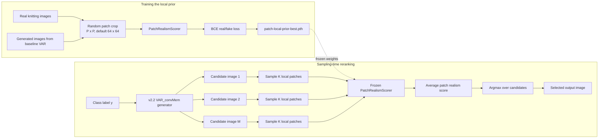
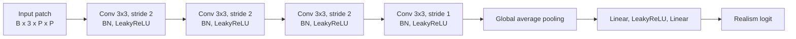

# Learned Local Prior Architecture

This figure summarizes the third innovation point as implemented in the project:
an auxiliary patch-level realism prior is trained separately, then used at
sampling time to rerank multiple VAR candidates.



## PatchRealismScorer detail



## Paper wording

The learned local prior estimates local texture realism from randomly sampled
image patches. During generation, the base VAR_convMem model samples multiple
candidate images for the same class label. Each candidate is decomposed into
local patches and scored by the frozen prior; the candidate with the highest
average patch realism score is selected as the final output.

Formula:

```text
s(I_j) = (1 / K) * sum_{k=1..K} f_theta(P_k(I_j))
I* = argmax_j s(I_j)
```

Code locations:

- `models/patch_realism_scorer.py`: lightweight CNN scorer.
- `train_patch_local_prior.py`: real/fake patch-level prior training.
- `test_var_convmem.py`: candidate generation, patch scoring, and reranking.
